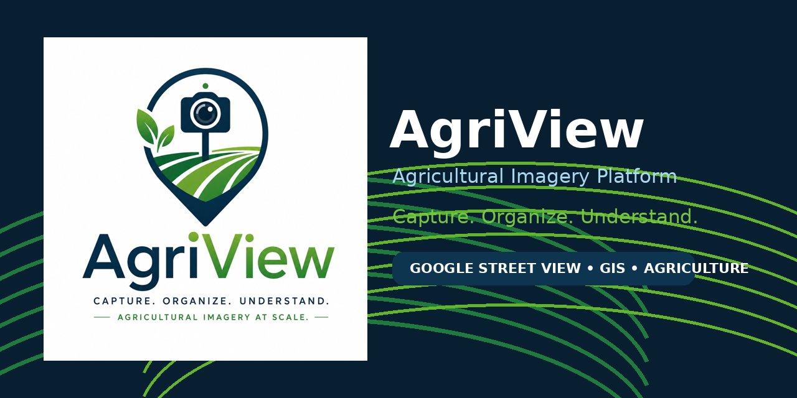
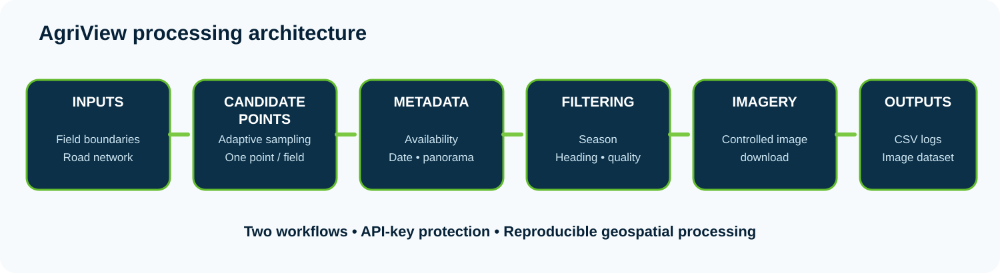

<p align="center">
  
</p>

# AgriView

### Agricultural Imagery Platform

**Capture. Organize. Understand.**

AgriView is a geospatial pipeline for identifying, validating, and retrieving Google Street View
imagery near agricultural fields. It combines field boundaries, road geometry, spatial sampling,
camera headings, metadata screening, and controlled image downloads to support agricultural
research and computer-vision dataset development.

> AgriView is an imagery-acquisition and organization pipeline. It does not claim to classify
> crops or diagnose field conditions.

<p align="center">
  
</p>

## Why this project matters

Satellite imagery provides a strong overhead perspective, while ground-level imagery can add
roadside context, crop visibility, landscape structure, and field-facing views. Acquiring useful
Street View imagery for agriculture requires more than sending coordinates to an API: candidate
locations must be spatially meaningful, camera headings must face the field, imagery availability
must be verified, and acquisition dates may need to match agricultural seasons.

AgriView packages those steps into two reproducible workflows.

## Core capabilities

- field-centric point generation from agricultural polygons and road networks;
- adaptive sampling along valid road–field frontages;
- low-cost one-point-per-field alternative;
- field-facing camera heading calculation;
- strong-curve and unstable-edge filtering;
- Google Street View metadata validation before image download;
- seasonal and heading-based download filters;
- points-only workflow for externally generated coordinates;
- structured CSV logs and organized imagery outputs;
- API credentials kept outside source code.

## Workflows

| Workflow | Best suited for |
|---|---|
| Field-centric adaptive | Broad spatial coverage with several field-facing views |
| Field-centric one point per field | Lower API cost and one representative view per field |
| Points only | Existing latitude/longitude locations generated elsewhere |

## Repository structure

```text
agriview/
├── .github/workflows/
├── assets/
│   ├── brand/
│   └── diagrams/
├── data/
├── docs/
├── examples/
├── outputs/
├── scripts/
│   ├── field_centric/
│   └── points_only/
├── .env.example
├── .gitignore
├── CITATION.cff
├── LICENSE
├── NOTICE
├── README.md
├── SECURITY.md
├── environment.yml
└── requirements.txt
```

## Installation

Using Conda:

```bash
conda env create -f environment.yml
conda activate agriview
```

Or using pip:

```bash
python -m venv .venv
pip install -r requirements.txt
```

## API configuration

AgriView reads the Google Maps Platform key from an environment variable.

Windows PowerShell:

```powershell
$env:GOOGLE_MAPS_API_KEY="your_restricted_api_key"
```

Windows Command Prompt:

```bat
set "GOOGLE_MAPS_API_KEY=your_restricted_api_key"
```

macOS or Linux:

```bash
export GOOGLE_MAPS_API_KEY="your_restricted_api_key"
```

Never commit your real API key.

## Field-centric workflow

Place the required field and road layers in `data/`, then choose one point-generation strategy.

Adaptive sampling:

```bash
python scripts/field_centric/step1_generate_points_adaptive.py
```

One representative point per field:

```bash
python scripts/field_centric/step1_generate_one_point_per_field.py
```

Collect Street View metadata:

```bash
python scripts/field_centric/step2_collect_streetview_metadata.py
```

Download filtered imagery:

```bash
python scripts/field_centric/step3_download_streetview_images.py
```

## Points-only workflow

Start with the provided sample:

```text
examples/sample_points.csv
```

Then run:

```bash
python scripts/points_only/step1_prepare_input_points.py
python scripts/points_only/step2_collect_streetview_metadata_points.py
python scripts/points_only/step3_download_streetview_images_points.py
```

## Example input

```csv
point_id,latitude,longitude,heading
sample_001,33.4550,-88.7930,90
sample_002,33.4575,-88.7905,180
```

## Outputs

AgriView generates candidate-point tables, metadata records, download-ready tables, imagery files,
and detailed processing logs. Production outputs and third-party imagery are intentionally excluded
from this public repository.

## Data and service responsibilities

Users are responsible for complying with the licenses and terms of every input dataset and service,
including agricultural boundary data, OpenStreetMap-derived road data, and Google Maps Platform.
See [`docs/DATA_AND_API_COMPLIANCE.md`](docs/DATA_AND_API_COMPLIANCE.md).

## Author

**Flavia Luize Pereira de Souza, Ph.D.**  
Geospatial engineer and agricultural data scientist working across GIS, remote sensing,
precision agriculture, and scalable data pipelines.

## License

This repository is shared for professional portfolio review, technical evaluation, and limited
noncommercial academic inspection. It is **not released under an open-source license**.
See [`LICENSE`](LICENSE).

## Citation

See [`CITATION.cff`](CITATION.cff).
